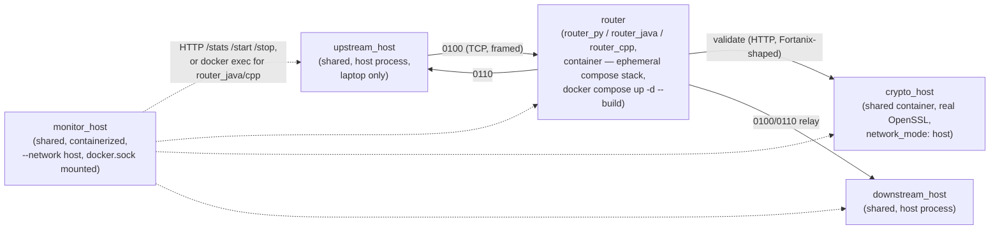
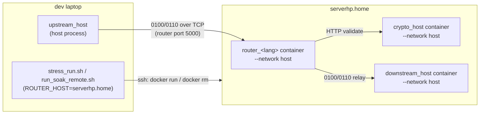

# Solution overview — containers, topology, and scripts

This is the map-of-the-territory doc: which pieces of the repo run as containers vs. bare
processes, how they talk to each other on a local dev laptop vs. on `serverhp.home`, and what
every script in the tree is for. It doesn't repeat the wire-level actor contract (see
`actors_overview.md`) or the per-language behavioral spec (each implementation's own
`build_router.md`), and it doesn't repeat the *why* behind the current shape (see
`../divide_and_conquer_v2.md`, the architecture decision log).

## What this is

Three ISO 8583 payment-router implementations — `router_py`, `router_java`, `router_cpp` — built
from the same functional spec, measured under identical load against shared test infrastructure
(crypto validation, an upstream load generator, a downstream echo host, one dashboard). Only the
router itself differs between them; everything else is deliberately shared code so the comparison
measures language/implementation overhead, not infrastructure drift. **Current status: python
(`router_py`) is the primary implementation** (proven good enough, most readable); java/cpp stay
in the repo as comparison contenders, not competing production candidates — see
`../divide_and_conquer_v2.md`'s "Strategy decision" pointer for the reasoning.

## Component → container map

| Component | Shared across implementations? | Containerized (local dev)? | Containerized (remote deploy)? | Default ports (wire / command) |
|---|---|---|---|---|
| `router_py` / `router_java` / `router_cpp` | No — this is what's under comparison | Yes, same ephemeral compose pattern for all three (see below) | Yes (`--network host`) | 5000 / 8080 |
| `crypto_host` (real, OpenSSL-backed) | Yes | Yes (`crypto_host/docker-compose.yml`, `network_mode: host`) | Yes | 5099 / 8099 |
| `crypto_host` (stub, per-language) | No — bundled into each router's own image/process, PAN-presence check only | Runs inside whichever router container it belongs to | Not deployed remotely (perf configs point at the real one instead) | 5002 / 8082 |
| `downstream_host` | Yes (one Python component, per-language config/PAN data) | No — host subprocess | Yes (`downstream_host/Dockerfile`, launched per-language by `server_start.sh`) | 5001 / 8081 |
| `upstream_host` | Yes (one Python component) | No — always a host subprocess, even when the router it's driving is remote | No — always runs on the laptop, connects out to `--router-host` | — / 8083 |
| `monitor_host` | Yes (one Flask app + a per-target `backends/<target>.py`) | Yes (`--network host`, `docker.sock` + repo bind-mounted in) | **Not deployed remotely** — local-only dashboard | — / 8090 |

All three routers now share one *ephemeral* `docker compose up -d --build` local-container
pattern (as of 2026-08-22 — `router_java` used to be the odd one out, a *persistent* dev container
kept alive with `tail -f /dev/null`; see `divide_and_conquer_v2.md`'s consolidation round for why):
the container's own `command:` launches crypto-stub + router (`router_cpp` also starts its own
downstream in the container's command, though the perf path now bypasses that — see its
`docker-compose.yml` comments) as background processes inside one container, torn down as a whole
with `stop.sh` (`docker compose down`). Individual actors (router, crypto stub) can still be
restarted inside an already-running container on demand via `docker exec -d` — by `monitor_host`'s
`backends/<target>.py` or by `test_resilience.py` — without tearing the whole stack down.

`monitor_host`'s per-target backend reflects the one remaining real difference: `router_py`'s
backend treats every actor type as a host subprocess it can `Popen` directly (no docker container
of its own actors at all in the monitor's model — `start.sh`/`stop.sh` above are a separate,
perf/deploy-oriented path); `router_java`'s and `router_cpp`'s backends `docker exec` into the
already-running container instead, since restarting a single JVM/binary process is cheaper than
rebuilding and restarting the whole compose stack. `upstream_host`/`downstream_host` are always
host subprocesses regardless of target.

## Local topology (perf/soak run, one implementation at a time)

All four ports (8080–8083) are on `localhost`/`network_mode: host`, which is exactly why the three
routers are mutually exclusive on one machine — every orchestration script that switches
implementations polls those ports free before starting the next one (see `stress_test.sh`'s and
`run_soak.sh`'s `wait_for_ports_free`).

## Remote topology (`serverhp.home`)

Remote mode exists because this dev laptop only has ~2.8GB RAM (see `briefs/run_soak.md`) — the
routers themselves move to a second machine, reached over SSH (`Host serverhp.home` in
`~/.ssh/config`, set up once via `config_sh/`). Only three things ever run on `serverhp.home`:
**`crypto_host`, `downstream_host`, and one router's container** — all `docker run -d --network
host`. `upstream_host` (the load generator) and `monitor_host` (the dashboard) are never deployed
there; `upstream_host` stays on the laptop and connects **out** to the router over the network
(`--router-host serverhp.home` / `ROUTER_HOST=serverhp.home`), and `monitor_host` isn't used in
remote runs at all — orchestration is scripted (`server_start.sh`/`server_stop.sh`), not
dashboard-driven.

Image transfer is `docker save <image> | ssh serverhp.home docker load` (see `deploy.sh`) — no
registry involved. `server_start.sh` enforces the same one-router-at-a-time rule remotely that
`wait_for_ports_free` enforces locally: starting one language's router first `docker rm -f`s any
other language's router container on the remote host, since only one can hold the shared
`--network host` ports there too.

## Script reference

### Bootstrap / one-time environment setup

| Script | Purpose | Usage |
|---|---|---|
| `start_docker.sh` | Ensures the Docker daemon is up (delegates to `router_java/dockerstart.sh`'s service/sudo/dockerd fallback logic). | `./start_docker.sh` |
| `startmeup.sh` | One-button entrypoint: checks the daemon, offers to `docker system prune`, then runs a throwaway 10s/impl `stress_test.sh` sweep purely to force a rebuild of all three images. | `./startmeup.sh` |
| `config_sh/add_serverhp.home` | Writes/replaces the `Host serverhp.home` block in `~/.ssh/config` from an IP/user you edit into the script first. | edit `IP`/`USER` at the top, then `./config_sh/add_serverhp.home` |
| `config_sh/add_serverhp.home.user.sh` | Generates an SSH key if needed and `ssh-copy-id`s it to `serverhp.home` for passwordless login; verifies it worked. | `./config_sh/add_serverhp.home.user.sh` (run after the script above) |
| `create_certificate.py` | Generates self-signed CA/cert/key triples (PKCS8, readable by all three languages' TLS stacks) for `crypto_host`, `downstream_host`, and each upstream partner. | `python3 create_certificate.py --ssl-active true\|false [--output-dir router_py/certs]` |
| `server.sh` | Trivial reachability ping to the server's IP — quick manual sanity check, not called by anything else. | `./server.sh` |
| `upgrade_java_20260814.sh` | One-off host JDK upgrade (21→25) via `update-alternatives`; run manually per laptop. Does **not** touch `JAVA_HOME` if you have it set — see the script's own gotcha comment. | `./upgrade_java_20260814.sh` |
| `fixjava.sh` | One-off diagnostic: runs `router_java` first-and-alone against a freshly restarted `crypto_host`, to isolate whether a mid-soak latency step is JVM-internal or caused by shared `crypto_host` connection-pool state carried over from a prior phase. | `./fixjava.sh` |
| `watch_crypto_conns.sh [duration_s]` | One-off diagnostic: polls `ss` for `crypto_host`'s plugin port (5099) once a second, logging TCP state counts to `csv_results/crypto_conns.csv`. Meant to run in a second terminal alongside `run_soak.sh`. | `./watch_crypto_conns.sh 1200` |

### Per-container lifecycle

| Script | Purpose | Usage |
|---|---|---|
| `crypto_host/start.sh` / `stop.sh` | Build+start / tear down the shared real `crypto_host` container. Idempotent — safe to re-run if already up. | `./crypto_host/start.sh` |
| `monitor_host/start.sh <target> [port]` / `stop.sh <target> [port]` | Build+start / stop the shared dashboard container for one target (`router_py\|router_java\|router_cpp`), default port 8090. | `./monitor_host/start.sh router_py` |
| `monitor.sh <target>` | Top-level convenience dispatcher — delegates to that implementation's own `monitor.sh`, which itself now just calls `monitor_host/start.sh`. | `./monitor.sh router_cpp` |
| `router_py/start.sh` / `stop.sh` | `docker compose up -d --build` / `down` for `router_py`'s ephemeral stack (router + its own crypto stub as the container's background processes). | `cd router_py && ./start.sh` |
| `router_cpp/start.sh` / `stop.sh` | Same ephemeral-compose pattern as `router_py`. `ROUTER_CONFIG=router_1_perf.json` on the host env before `start.sh` points the router at the shared real `crypto_host` instead of the in-container stub. | `cd router_cpp && ROUTER_CONFIG=router_1_perf.json ./start.sh` |
| `router_java/start.sh` / `stop.sh` | `docker compose up -d --build` / `down` for `router_java`'s ephemeral stack (router + its own crypto stub as the container's background processes), same pattern as `router_py`'s/`router_cpp`'s. `start.sh` also runs `dockerstart.sh` first (daemon bootstrap). | `cd router_java && ./start.sh` |
| `router_java/dockerstart.sh` | Ensures the Docker daemon is up (service/sudo/dockerd fallback logic — see `start_docker.sh`); also copies optional sandbox trust files into `.ccr-optional/` if present, used by the image build's Maven-dependency-resolution stage. | rarely called directly — use `start.sh` |
| `router_java/run_tests.sh` | Runs the JUnit suite (`mvn test`, including the full-stack integration test) in a one-shot container built from the Dockerfile's `build` stage — there's no persistent dev container to `docker exec` into for this anymore. | `cd router_java && ./run_tests.sh` |

`downstream_host` and `upstream_host` have no `start.sh`/`stop.sh` of their own locally — they're
always launched as host subprocesses by whichever script needs them (`run_test.sh`,
`stress_run.sh`, or `monitor_host`'s backend).

### Per-implementation functional test driver

| Script | Purpose | Usage |
|---|---|---|
| `<impl>/run_test.sh [--manual] <csv_file>` | Spawns crypto/downstream/router/upstream (or attaches to already-running ones with `--manual`), runs one pass of the CSV, prints a PAN/response-code/auth-code/field-47 report plus the router's stats, tears down. | `cd router_py && ./run_test.sh ../test_csv_files/test.csv` |

### Performance / soak testing

| Script | Purpose | Usage |
|---|---|---|
| `<impl>/stress_run.sh [--manual] <tps> <duration_s> <csv_file> [warmup_s]` | Single-implementation perf run against the shared real `crypto_host`; prints exactly one CSV result row to stdout and appends to `csv_results/slow_responds.csv`/`latency_buckets.csv`. Honors `ROUTER_HOST`/`SERVER_USER` to target `serverhp.home` instead of localhost. | `cd router_java && ./stress_run.sh 100 60 ../test_csv_files/test.csv` |
| `stress_test.sh [--tps 50,100,200,400] [--duration 30] [--impl router_py,router_java,router_cpp] [--csv <path>]` | Top-level sweep: starts the shared `crypto_host` once, then runs every (implementation × tps) combination via that implementation's `stress_run.sh`, appending to `csv_results/stress_results.csv`. A single failed run doesn't abort the sweep. | `./stress_test.sh --tps 100,200 --impl router_py` |
| `run_soak.sh [number_of_minutes]` | Fixed 3-phase sequence (py → cooldown → java → cooldown → cpp), each phase at 100 tps for `number_of_minutes` (default 10). Appends `csv_results/soak_results.csv`/`soak_summary.csv`. Meant to run standalone, IDE closed — see `briefs/run_soak.md` for why (this laptop's RAM). | `./run_soak.sh 20` |
| `run_soak_remote.sh [number_of_minutes]` | Same sequence targeted at `serverhp.home`; requires `SERVER_USER`, fails fast if the host isn't reachable, tags every row `env=serverhp.home`. | `SERVER_USER=<user> ./run_soak_remote.sh 15` |
| `test_resilience.sh [--impl router_py,router_java,router_cpp]` | Runs each implementation's own `test_resilience.sh` narrated failure-scenario suite in turn (currently only `router_py` has one — others are skipped, not failed). See `resilience.md`. | `./test_resilience.sh --impl router_py` |
| `sync_test_csv.sh` | Mirrors the master `test_csv_files/` into each implementation's local `test_csv_files/` (their own `run_test.sh` and monitor CSV dropdown read the local copy, not the root). Re-run after editing/adding a CSV at the root. | `./sync_test_csv.sh` |

### Remote deployment (`serverhp.home`)

| Script | Purpose | Usage |
|---|---|---|
| `deploy.sh [crypto\|downstream\|py\|java\|cpp ...]` | Builds the requested image(s) locally, transfers each via `docker save \| ssh serverhp.home docker load` (no registry), then calls `server_start.sh` for everything except a bare `downstream` build (which has no lifecycle of its own — see below). Omit targets to deploy and start all five. | `SERVER_USER=<user> ./deploy.sh py` |
| `server_start.sh [crypto\|py\|java\|cpp ...]` | `docker run -d --network host` on `serverhp.home` for the requested component(s). Starting a router also (re)starts `downstream_host` with that language's PAN/key config, and first stops any *other* language's router container (only one can hold the shared ports remotely too). | `SERVER_USER=<user> ./server_start.sh java` |
| `server_stop.sh [crypto\|py\|java\|cpp ...]` | `docker rm -f` on `serverhp.home` for the requested component(s). Omit targets to stop all three routers (crypto stopped separately). | `SERVER_USER=<user> ./server_stop.sh` |

`deploy.sh`'s `downstream` target is build+push only, never started standalone — `downstream_host`
has no independent lifecycle on the server; it always (re)starts paired with whichever router
`server_start.sh` is asked to bring up.

## Where to look next

- **Wire-level actor contract** (ports, config fields, PAN data, SSL): `actors_overview.md`.
- **Full per-actor behavioral spec, per language**: `<impl>/build_router.md`.
- **Why the architecture looks like this, round by round**: `../divide_and_conquer_v2.md`.
- **Shared component internals**: `../crypto_host/build_router.md`, `../downstream_host/build_router.md`, `../upstream_host/build_router.md`, `../monitor_host/build_router.md`.
- **Soak-run operational runbook**: `run_soak.md`.
