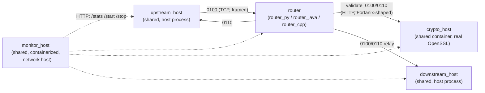

# Divide and conquer v2 — architecture overview

`divide_and_conquer.md` is a chronological decision log (proposal → discussion → "Done:" write-up,
repeated per round). This file is not that — it's a clean snapshot of where the three rounds
documented there actually left the architecture, for anyone who wants the current "what and why"
without reading the whole discussion history.

## The comparison goal

Three ISO 8583 payment-router implementations — Python (`router_py`), Java (`router_java`), C++ (`router_cpp`) —
built from the same functional spec, run under identical stress tests to measure real
language/implementation performance overhead (expected ordering: C++ > Java > Python; the open
question was always the threshold, not the direction).

That comparison only means something if the *router* is the only thing that differs between runs.
Everything else — crypto validation, the load generator, the echo downstream — is test
infrastructure, and duplicating infrastructure three times over doesn't sharpen the comparison, it
just triples the maintenance cost and gives each copy a chance to quietly diverge. Rounds 1 and 2
were about identifying which pieces were actually infrastructure and factoring them out, one at a
time, in a way that never touched the router being measured. Round 3 (rename + `router_2`/
`upstream_2` + EBCDIC) is different in kind — it's not further extraction, it's restoring parity
across the three implementations and adding a second, differently-encoded partner scenario to
exercise — but is included here for the same reason: it's now part of the current architecture,
not just history.

## What's shared vs. per-implementation, and why

| Component | Shared? | Where | Why |
|---|---|---|---|
| **router** | No — this is the comparison | `router_py/router`, `router_java/…/router`, `router_cpp/src/router` | The whole point of the project |
| **crypto_host (real)** | Yes | `routers/crypto_host/` | The actual performance bottleneck under test — every implementation must be measured against the *same* bottleneck, or the comparison is meaningless |
| **crypto_host (stub)** | No | `<impl>/simulators/crypto_host` | Kept local, no OpenSSL, just a PAN-presence check — lets each implementation build/functionally-test standalone without the shared container running |
| **upstream_host** | Yes | `routers/upstream_host/` | Pure test infrastructure (load generator), zero comparison value — three reimplementations existed only for parity, not because the language mattered |
| **downstream_host** | Yes | `routers/downstream_host/` | Trivial IMS-Connect-style echo/approve-decline stub, zero comparison value — same reasoning as `upstream_host`, consolidated in the same round-5-adjacent readability pass. Configs stay per-implementation (each language's `pans_defined.json` test data genuinely differs) even though the code is now shared |
| **monitor** | Yes (since 2026-08-17) | `routers/monitor_host/` | Was three ported copies (`<impl>/monitor/`, now retired/inert) — "mutually exclusive, same host ports" turned out not to require separate code, only a `--target` flag: one shared Flask app + lifecycle plumbing, with per-target discovery/launch mechanics (`docker exec`, host subprocess) factored into a small `backends/<target>.py` module instead of duplicated whole-file |

### Round 1 — `crypto_host` (see `divide_and_conquer.md` part 1)

Real OpenSSL-backed EMV validation (PIN/ARQC/CVV2/AAV verification, ARPC computation) was
extracted out of router_cpp — where it started — into its own container: `routers/crypto_host/`, a
standalone CMake/C++ project with its own Dockerfile, `docker-compose.yml`, `start.sh`/`stop.sh`,
listening on ports 5099 (wire)/8099 (command). All three implementations' `*_perf.json` router
configs point their crypto client at it during performance runs. It's shared infrastructure, not
one of the three things under comparison — `stress_test.sh` starts it once and leaves it running
for the whole sweep, never tearing it down between implementations.

Along the way, router_py's wire contract for talking to crypto had drifted from router_java's/router_cpp's
Fortanix-shaped protocol (`POST /sys/v1/plugins/{plugin_id}`, bearer auth, base64 envelope) — it
still spoke a bespoke `POST /validate_0100` with no auth. Fixed forward so all three could plug
into the one shared container.

### Round 2 — `upstream_host` (see `divide_and_conquer.md` part 2)

The stress-test load generator — uploads a CSV, sends `0100`s at a configured rate, collects
`0110`s, exposes the `/stress_stats`/`/slow_responses`/`/latency_buckets` HTTP API — was
reimplemented independently in Python, Java, and C++, purely to keep parity across the three
projects. None of that duplication served the comparison: the router is what's measured, not the
thing generating load against it.

Consolidated into `routers/upstream_host/`: a single Python implementation (a promoted copy of
router_py's original, the proven one), running as a **bare host process**, not containerized — alongside
the monitor tooling, which was already host-side and uncontainerized. Rationale: every actor talks
over `localhost` regardless of implementation (host networking throughout), so containerizing the
load generator would buy no real isolation, only a rebuild-cycle tax on the one piece that gets
iterated on most during perf work. The three per-language reimplementations (Java's
`UpstreamHostMain.java`, C++'s `upstream_host_main.cpp`) were deleted; each implementation's
`stress_run.sh`/`run_test.sh`, and the shared dashboard (`monitor_host/`, see "The monitor got
consolidated too" below), now launch the shared component instead (`docker exec`/native-binary
launches replaced with a host `subprocess.Popen` of the same shared script everywhere).

**Two real cross-language wire-format bugs surfaced doing this** — both invisible before the
migration because each router had only ever been tested against its own same-language
`upstream_host`, so an internally-consistent-but-different convention on either side never showed
up:
- **router_java**: j8583's `MessageFactory` defaults to a text/ASCII-hex bitmap; the shared component's
  pyiso8583 spec (`test_spec.json`, `"data_enc": "b"`) encodes the primary/secondary bitmap as raw
  binary bytes. Fixed with one `factory.setUseBinaryBitmap(true)` call in `IsoUtils.loadFactory()`.
- **router_cpp**: the hand-rolled codec encoded the MTI as 2 raw binary bytes; pyiso8583 (and j8583)
  encode it as 4 ASCII characters (`"0100"`). Fixed in `iso_codec.cpp`'s `encode()`/`decode()`.

**Open follow-up from round 2, partially addressed by round 3 below**: this pattern (each language
quietly picking its own encoding-convention interpretation, discovered only by trial and error)
shouldn't be hardcoded per implementation. `test_spec` should become the actual single source of
truth for wire-encoding choices, not just field shapes — and it may need multiple variants, one
per real-world partner being emulated (different partners can genuinely use different bitmap/MTI
conventions, not just different field lists). See `divide_and_conquer.md`'s "Note for next round."
Round 3 delivered the "multiple variants, one per partner" half of this (`test_spec.json` vs
`test_spec_ebcdic.json`, selected per router instance) but not the more ambitious "spec file
itself declares its own encoding convention, read uniformly by every language's codec" half — each
language still gets its own explicit encoding switch (`upstream_iso_spec` in router_py,
`upstream_iso_encoding` in router_java, `upstream.encoding` in router_cpp) rather than one
generic mechanism. Still open, if a future partner needs more variation than ASCII-vs-EBCDIC.

### Round 3 — rename, `router_2`/`upstream_2`, EBCDIC

(See `divide_and_conquer.md`'s "renames, missing functionality and iso specs" section for the
original request and clarifying-question resolution.)

Three related pieces of work, done together as one round:

**Rename**: `xv5`/`xv6java`/`xv7cpp` → `router_py`/`router_java`/`router_cpp` — every directory,
script, `docker-compose.yml` `container_name`, the Java build's artifact/jar name, the CMake
project name, and every doc/comment reference, down to zero remaining hits outside `com.xv6.*`/
`xv6::` (Java/C++ internal namespaces, deliberately left alone) and historical CSV run data
(left alone — new runs write new rows under the new names; rewriting old ones would falsify
history). This document and file paths throughout already reflect the new names.

**`router_2`/`upstream_2` restored to parity**: router_py already had a second, independent
router+load-generator pair (disabled by default, `router_2` connecting **out** to `upstream_2` in
reversed client/server roles from `router_1`'s topology, reusing the same `downstream_host`/
`crypto_host` distinguished only by `downstream.client_id`) that never made it into router_java or
router_cpp when they were ported. Replicated into both, matching config-file shape exactly.
router_java's monitor needed a one-line discovery-gate fix (it only recognized
`router`/`downstream`/`crypto` actor types, silently dropping the new `upstream`-typed
`config/upstream_2.json`); router_cpp's monitor needed a real extension — it previously read
*one* shared `config/router_1.json` for all four of `router_1`'s actors and had no concept of a
second router instance at all, so `router_2`/`upstream_2` needed genuine per-actor config-path
tracking added, not just a new file.

**EBCDIC on `router_2`'s upstream leg only**: `router_2` demonstrates a partner that speaks EBCDIC
instead of ASCII, via a new `routers/upstream_host/test_spec_ebcdic.json` (field-by-field copy of
`test_spec.json`, `data_enc`/`len_enc` flipped to `"cp500"` on text fields, binary fields
untouched). Each router's spec/encoding is split into an upstream-facing half (EBCDIC on
`router_2`) and a downstream-facing half (always ASCII, all routers, all instances) — a literal
single-encoding swap on `router_2` would have broken its downstream leg, since the shared
`downstream_host` only understands ASCII and every request would time out rather than complete.

Two more real cross-language findings, both confirmed by hands-on testing:
- **router_java**: j8583's `setCharacterEncoding("Cp500")` alone translates the MTI and field data
  to EBCDIC but silently leaves the LLVAR/LLLVAR length-prefix digits in plain ASCII — confirmed
  by disassembling `IsoValue.writeLengthHeader`'s bytecode. Needs `setForceStringEncoding(true)`
  enabled alongside it for a genuinely fully-EBCDIC message.
- **router_cpp**: the hand-rolled codec had zero encoding concept before this round. Added an
  `Encoding` enum threaded through `iso_codec`, reusing the project's existing CP500 lookup table
  via two new byte-for-byte (no padding/truncation) translation helpers.

All three implementations' EBCDIC leg was verified with a live CSV burst (correct response codes)
and cross-checked byte-for-byte against each other, not just internally self-consistent. See each
implementation's `build_router.md` for full detail.

### `downstream_host` consolidation + `xv6` naming cleanup (2026-08-13)

A readability/DRY pass, done after SSL/TLS landed across all three implementations and before
moving on to soak testing. Two pieces:

**`downstream_host` consolidated into shared Python**, the same treatment `upstream_host` got in
Round 2 — it was the one remaining per-language-duplicated simulator besides `crypto_host` (which
stays excluded, per-language, deliberately). Removed ~700 lines of duplicated Java/C++
reimplementation (`DownstreamHostMain.java`, `downstream_host_main.cpp`) in favor of one shared
`routers/downstream_host/main.py`, launched as a host subprocess by every implementation's
`run_test.sh`/`stress_run.sh`/`monitor`, exactly like `upstream_host` already is. Unlike
`upstream_host`, **configs stay per-implementation** — each language's `pans_defined.json` test
PAN/key data genuinely differs (confirmed by diffing all three: router_py's own set,
router_java's/router_cpp's shared-but-different set, and `crypto_host`'s real set are three
distinct datasets), so only the code was duplicated, not the data. `router_cpp` previously had no
standalone `downstream_host.json` (its downstream settings lived as a nested block inside
`config/router_1.json`) — extracted a flat one, mirroring `router_java`'s existing shape.

**Real bug found and fixed during router_java's port**: a genuine cross-language mTLS deadlock.
Java's `SSLSocket` defers its TLS handshake to the connection's first read/write (see
`SslUtils.createSocket`'s doc comment); the shared `downstream_host`'s `_accept_loop()` performed
`wrap_server_socket()` *synchronously inside the single accept loop thread*, before spawning the
per-connection dispatch thread. Router opens two sockets (to-conn, from-conn) and triggers their
handshakes in a different order than the acceptor sees their TCP connects in — router_py's own
client happens to avoid this (its `wrap_client_socket` handshakes eagerly, immediately after each
`connect()`, so there's never two half-open connections at once) — but router_java's ordering hit
it every time, wedging the server's accept loop on one connection while the client waited on the
other, neither side able to progress. Never surfaced before because router_java's downstream leg
had only ever talked to its own same-language TLS server (client-role code exercised against a
Python TLS server for the first time by this consolidation) — the same "invisible until
cross-wired" pattern as Round 2's bitmap-encoding bug and Round 3's EBCDIC length-prefix bug.
Fixed by moving the handshake into the per-connection dispatch thread (`downstream_host/main.py`'s
`_dispatch_new_conn`), completing a deadlock-avoidance pattern the file's own docstring already
half-described for the plaintext read path.

**`xv6` legacy internal naming cleaned up**: `router_java`'s Java package (`com.xv6.*` →
`com.router.*`) and `router_cpp`'s C++ namespace/CMake targets (`xv6::router`/`xv6::shared` →
`router::`/`shared::`, `xv6_router`/`xv6_shared`/`xv6_tests` → `router_lib`/`shared_lib`/
`router_tests`) — cosmetic leftovers from the pre-2026-08-01 `xv6java`/`xv7cpp` names that survived
the directory rename, done here since this pass already touched most of the same files.

**The monitor got consolidated too (2026-08-17).** Same story as `upstream_host`/`downstream_host`:
each implementation had its own ~600-line `<impl>/monitor/main.py` + `static/index.html`, and the
copies had already drifted (router_cpp's `is_running()` took an actor dict where the other two took
a name string — see `to_do_java_cpp.md`). Collapsed into `monitor_host/`: one shared Flask app +
actor-lifecycle plumbing, driven by a small per-target `backends/<target>.py` module supplying
discovery + launch/stop mechanics. Unlike `upstream_host`/`downstream_host`, this one *is*
containerized (`--network host` + the repo bind-mounted in + `docker.sock` mounted in, so it can
`docker exec` into `router_java`/`router_cpp` the same way a bare host process could) — see
`monitor_host/build_router.md` for the full architecture and backend contract. Each implementation's
`monitor.sh`/`monitor_stop.sh`/`kill_monitor.sh` now delegate to `monitor_host/start.sh`/`stop.sh`
rather than running their own copy; the old `<impl>/monitor/` directories are inert, kept only until
the consolidated UI has been eyeballed for all three targets.

## Current repository layout

```
routers/
├── divide_and_conquer.md       # decision log (chronological, all three rounds)
├── divide_and_conquer_v2.md    # this file — architecture snapshot
├── stress_test.sh              # sweeps a TPS list across all three implementations
├── run_soak.sh / run_soak.md   # standalone multi-phase soak sequence + its runbook
├── test_csv_files/              # MASTER input CSVs - stress_test.sh/run_soak.sh read from here;
│                                 # each implementation's own local test_csv_files/ is a mirror,
│                                 # for that implementation's own run_test.sh/monitor dropdown only
│                                 # (see sync_test_csv.sh)
├── sync_test_csv.sh             # mirrors test_csv_files/ into each implementation's local copy
├── csv_results/                # all output CSVs live here, kept out of the repo root
│   ├── stress_results.csv      # one row per (implementation, tps) run
│   ├── slow_responds.csv       # 10 slowest round-trips per run
│   ├── latency_buckets.csv     # time-bucketed p50/max per run
│   ├── soak_results.csv        # one row per soak-sequence phase (incl. p90)
│   └── soak_summary.csv        # p50/p90/p99 only, per soak-sequence phase
├── monitor.sh                  # dispatches to whichever implementation's own monitor launcher
│
├── crypto_host/                # SHARED — real OpenSSL-backed crypto, containerized
│   ├── CMakeLists.txt / Dockerfile / docker-compose.yml / start.sh / stop.sh
│   ├── config/{crypto_host.json, pans_defined.json}
│   └── src/{shared, router, simulators/crypto_host}
│
├── upstream_host/               # SHARED — load generator, host-side (not containerized)
│   ├── main.py                  # the whole implementation
│   ├── config.json               # upstream_1's config — one shared file for all three
│   ├── test_spec.json            # pyiso8583 JSON spec, ASCII — router_1's wire-compatible format
│   ├── test_spec_ebcdic.json     # same field shapes, cp500 instead of ascii — router_2's spec
│   ├── upstream_shared/          # forked copy of router_py/shared's small utility modules
│   └── build_router.md
│
├── downstream_host/              # SHARED — IMS-Connect-style echo/approve-decline stub,
│   ├── main.py                  #   host-side (not containerized)
│   ├── downstream_shared/        # forked copy of router_py/shared's small utility modules
│   └── build_router.md           # configs stay per-implementation — see this doc for why
│
├── monitor_host/                # SHARED — dashboard, containerized (network host + docker.sock)
│   ├── main.py                   # actor-lifecycle plumbing, identical across targets
│   ├── backends/{router_py,router_java,router_cpp}.py   # per-target discovery + launch/stop
│   ├── static/{router_py,router_java,router_cpp}/index.html   # per-target, not shared
│   └── build_router.md
│
├── router_py/                         # Python router — under comparison
│   ├── router/, shared/, simulators/{crypto_host (stub), upstream_2}
│   │   router/router_2/config.json — second partner, disabled by default, EBCDIC upstream leg
│   │   (see Round 3); simulators/downstream_host/{config.json,config_perf.json} — this
│   │   implementation's own config for the shared downstream_host component
│   ├── monitor/                  # retired 2026-08-17, inert — see monitor_host/ above
│   └── stress_run.sh / run_test.sh
│
├── router_java/                     # Java router — under comparison
│   ├── src/main/java/com/xv6/{router, shared, simulators/cryptohost}
│   │   config/router_2.json + config/upstream_2.json — same second-partner pattern
│   │   config/downstream_host.json + downstream_host_perf.json — this implementation's own
│   │   config for the shared downstream_host component
│   ├── monitor/                  # retired 2026-08-17, inert — see monitor_host/ above
│   └── stress_run.sh / run_test.sh
│
└── router_cpp/                       # C++ router — under comparison
    ├── src/{router, shared, simulators/crypto_host}
    │   config/router_2.json + config/upstream_2.json — same second-partner pattern
    │   config/downstream_host.json + downstream_host_perf.json — this implementation's own
    │   config for the shared downstream_host component
    ├── monitor/                   # retired 2026-08-17, inert — see monitor_host/ above
    └── stress_run.sh / run_test.sh
```

## Runtime topology (per implementation, during a perf run)



Only `router` is containerized per implementation; `crypto_host`, `upstream_host`,
`downstream_host`, and now `monitor_host` are all shared — `monitor_host` runs one target at a time
(`--target router_py|router_java|router_cpp`) and just proxies HTTP to whichever actors are
currently running, same as the per-implementation monitor it replaced.

## How to run things

```bash
# Full comparison sweep across all three, sweeping a TPS list:
./stress_test.sh                                   # defaults: 50/100/200/400 tps, 30s each
./stress_test.sh --tps 80 --duration 60 --impl router_cpp

# One implementation's dashboard (mutually exclusive — same host ports):
./monitor.sh router_py        # or router_java / router_cpp

# One implementation's own functional/stress driver:
cd router_cpp && ./run_test.sh test_csv_files/test.csv
cd router_cpp && ./stress_run.sh 80 60 test_csv_files/test.csv
```
